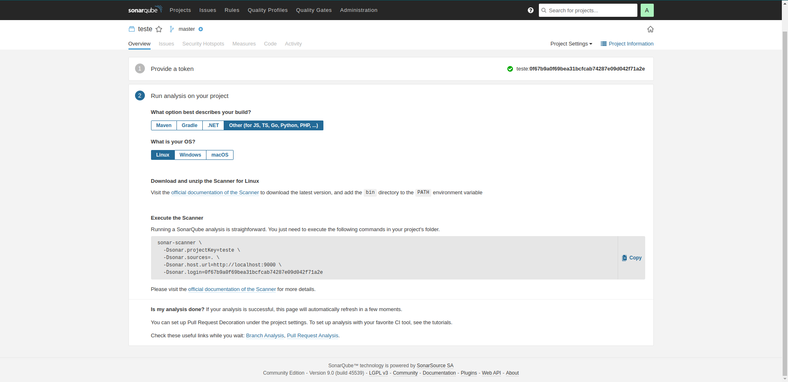

# Análise de Qualidade

## Tabela de Conteúdos

- [Análise de Qualidade](#análise-de-qualidade)
  - [Tabela de Conteúdos](#tabela-de-conteúdos)
- [Análise Estática de Código](#análise-estática-de-código)
  - [Verificação x Validação](#verificação-x-validação)
  - [Classificação](#classificação)
  - [SonarQube](#sonarqube)
    - [Docker](#docker)
      - [Requisitos](#requisitos)
    - [Configuração do Container](#configuração-do-container)
      - [Base de Dados](#base-de-dados)
      - [Volumes](#volumes)
    - [Primeira Execução](#primeira-execução)
    - [Configuração Manual](#configuração-manual)
    - [Scaneamento de Projeto](#scaneamento-de-projeto)

# Análise Estática de Código

É uma das práticas que verifica a qualidade do código fonte. A verificação ocorre antes da execução do software (diferente dos testes unitários que validam o software com base no resultado de sua execução).

## Verificação x Validação

- Verificação

  Considera "fazer certo alguma coisa" - garantir que os passos para um certo objetivo foram realizados corretamente.
  Verificação é eficiencia.

- Validação

  Trata de "fazer a coisa certa" - garantir que o objetivo seja atingido, independente de como os passos foram realizados.
  Validação é eficácia.

  A análise estática de código é relacionada à verificação visto que analisa como o código fonte foi construído internamente.

## Classificação

A análise estática de código pode agrupada em 3 aspectos principais:

- Verificação por estilo

  Considera elementos como identação, espaços e tabs, convenção de nomes, número de parâmetros, alinhamento vertical, presença de comentários e etc. Tais aspectos tornam o código mais padronizado, organizado e legível.

- Verificação por boas práticas

  Aplica algumas regras para verificar se práticas corretas estão sendo aplicadas, como evitar duplicação de código, implementação de métodos corretamente, tamanho de classes e métodos, tamanho de parâmetros, criação de variáveis locais desnecessáriamente e etc.

- Verificação por bugs

  Procura erros no sistema. Importante para antecipar a identificação de problemas de software, como identificação de possíveis impactos na segurança so sistema.

## SonarQube

Plataforma de código aberto desenvolvida pela SonarSource para inspeção contínua de qualidade de código. Realiza revisões automáticas com análise estática de código para detectar bugs, bad smells e vulnerabilidades de segurança em mais de 20 linguagens de programação.


Esta ferramenta fornece relatórios de código duplicado, padrões de codificação, testes unitários, cobertura de código, complexidade cliclomática, comentários, erros, débitos e vulnerabilidades de segurança. Há também o registro do histórico de métricas para fornacer gráficos de evolução.

O SonarQube faz uma análise automatizada e pode ser integrado com Maven, Ant, Gradle, MSBuid e ferramentas de integração contínua.

### Docker

Uma das formas mais simples de instalar e utilizar o SonarQube localmente é utilizando a tecnologia de containers, no caso Docker.

#### Requisitos

Como o SonarQube usa um ElasticSearch embutido, a configuração do host Docker deve estar em conformidade com os requisitos do modo de produção do ElasticSearch.

Por exemplo, no Linux, os valores recomendados podem ser configurados com os seguintes comandos:

```sh
sudo sysctl -w vm.max_map_count=262144
sudo sysctl -w fs.file-max=65536
sudo ulimit -n 65536
sudo ulimit -u 4096
```

Além disso, instale o [sonar-scanner-cli](https://docs.sonarqube.org/latest/analysis/scan/sonarscanner/)

### Configuração do Container

#### Base de Dados

Por padrão, a imagem utilizará um banco de dados H2 integrado que, geralmente, não é recomendado para produção.

#### Volumes

É recomendado a criação de volumes para os seguintes diretórios:

- /opt/sonarqube/conf: para a versão 7.9.x apenas , arquivos de configuração, como sonar.properties.
- /opt/sonarqube/data: arquivos de dados, como o banco de dados H2 incorporado e índices Elasticsearch
- /opt/sonarqube/logs: contém registros SonarQube sobre acesso, processo da web, processo CE, registros Elasticsearch
- /opt/sonarqube/extensions: para plug-ins de terceiros

### Primeira Execução

Para criar e executar o SonarQube em container pela primeira vez, na forma mais básica (banco H2 e sem volumes), execute:

```sh
sudo docker run --name sonarqube -p 9000:9000 -p 9092:9092 --restart=unless-stopped -d sonarqube
```

### Configuração Manual

Após iniciado, acesse o endereço da interface web local: `http://localhost:9000/`

- Na tela de login inicial, use o login/senha: **admin/admin**

  

- Após isso haverá uma tela para atualizar a senha, faça de acordo com sua preferência.

### Scaneamento de Projeto

Para iniciar a análise em determinado projeto, siga os passos:

- Apertar o botão _create new project_ ou _add project > manually_.

  

- Informe um nome ou chave únicos correspondente ao seu projeto.

  

- Insira o nome para o token gerado.

  

- Após gerar e você clicar _continue_, escolha a tecnologia e sistema operacional do projeto a ser analisado.

  
  

- Nesse ponto, caso não tenha instalado o [sonar-scanner-cli](https://docs.sonarqube.org/latest/analysis/scan/sonarscanner/) como mencionado no passo de [Requisitos](#requisitos), será sugerido a instalação do [sonar-scanner-cli](https://docs.sonarqube.org/latest/analysis/scan/sonarscanner/).

- Copie o comando gerado em **Execute the Scanner** (como nas imagens acima), mova o cursor para a pasta do projeto no terminal, cole e execute o comando. Em outras palavras, execute o comando copiado na pasta do projeto.

A interface padrão é bem intuitiva, com abas e opções correspondentes as métricas geradas:


